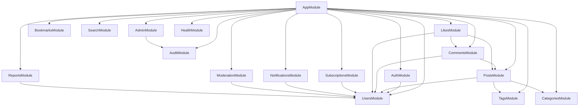

# InkStream — Technical Architecture

This document outlines the architectural patterns, module structure, and design decisions implemented in the InkStream backend.

## 1. Module Graph & Domain Boundaries

InkStream follows a strict modular structure to ensure separation of concerns and prevent circular dependencies.

### Domain Ownership
- **AuthModule**: Handles Passport strategies (Local/JWT), token generation, and password hashing.
- **UsersModule**: Manages profiles, follows, and blocks.
- **PostsModule**: Core content engine including draft management, slug generation, and reading time calculation.
- **SubscriptionsModule**: Gating logic and plan lifecycle.
- **ModerationModule**: Business logic for content suppression and user safety.

## 2. Concept to Feature Mapping

This project maps core NestJS and backend concepts to specific platform features:

| Concept | Implementation in InkStream |
| :--- | :--- |
| **Guards** | `JwtAuthGuard`, `RolesGuard`, `OwnershipGuard` (Post/Comment edit), `SubscriptionGuard` (Premium content). |
| **Pipes** | `ValidationPipe` (Global), `ParseUUIDPipe` (IDs), `TrimStringsPipe` (Custom sanitization). |
| **Filters** | `HttpExceptionFilter` (Global error shape), `TypeOrmExceptionFilter` (DB error mapping). |
| **Decorators** | `@CurrentUser`, `@Roles`, `@Public`, `@RequiresPlan`, `@ApiPaginatedResponse`. |
| **Events** | `EventEmitterModule` used for async notifications (Likes, Comments, New Posts). |
| **TypeORM** | Complex relations (M:N Tags, Follow graph), Transactions for counter updates (likeCount). |
| **Security** | Bcrypt cost 10, Hashed Refresh Tokens, Throttling on Auth routes, Helmet/CORS. |
| **Swagger** | Comprehensive documentation with examples and standard pagination envelopes. |

## 3. Key Design Decisions

### 3.1 Idempotent Social Interactions (Likes Module)
The `LikesModule` is separated from Posts/Comments to centralize the "toggle" logic.
- **Rationale**: Both posts and comments use identical logic for likes. Centralizing this prevents duplication and allows for a shared unique constraint in the DB, ensuring a user can only like a specific target once.

### 3.2 Threaded Comments (1-Level Deep)
Comments support a single level of nesting.
- **Rationale**: To prevent "comment depth hell" and simplify frontend rendering, replies to a reply are automatically flattened to become siblings of the first-level reply. This logic is handled in the `CommentsService`.

### 3.3 Event-Driven Notifications
Notifications are not created in-line with the action that triggers them.
- **Rationale**: When a user likes a post, the `LikesService` emits a `post.liked` event. The `NotificationsListener` picks this up asynchronously. This ensures that a failure in the notification system doesn't cause a user's primary action (liking) to fail.

### 3.4 Soft Deletion Pattern
Core entities (Posts, Comments, Users) implement a soft-delete pattern.
- **Rationale**: Business requirements require that content can be hidden or restored. Using TypeORM's `@DeleteDateColumn` allows us to exclude deleted items from public queries by default while retaining the data for moderation/audit purposes.

### 3.5 Schema Integrity & Counters
To avoid expensive `COUNT(*)` queries on every read, entities like `Post` maintain denormalized counters (`likeCount`, `commentCount`).
- **Rationale**: These counters are updated within TypeORM transactions during the creation/deletion of likes/comments to ensure consistency between the aggregate count and the actual relation rows.

## 4. Security & Compliance

### Authentication Workflow
1.  **Access Token (JWT)**: Short-lived (15m), kept in memory/session.
2.  **Refresh Token (JWT)**: Long-lived (7d), stored hashed in the database.
3.  **Rotation**: On every refresh request, a new access token is issued. Refresh tokens are revocable upon logout or password reset.

### Rate Limiting
Auth endpoints (`/auth/login`, `/auth/forgot-password`) are protected by the `ThrottlerGuard`, limiting attempts to 5 per minute per IP to prevent brute-force attacks.

### Data Validation
The platform enforces strict DTO validation. Any property sent by the client that is not explicitly defined in the DTO is rejected (`forbidNonWhitelisted: true`), preventing mass-assignment vulnerabilities.
